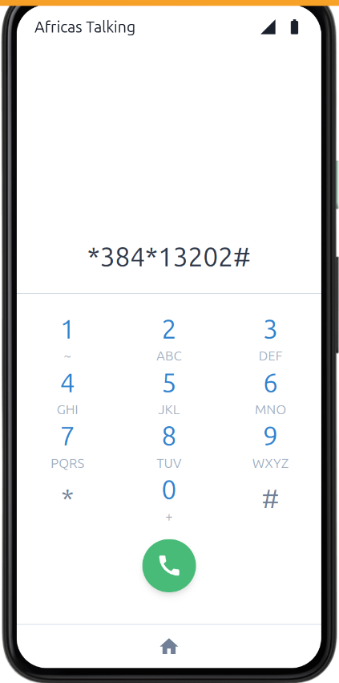
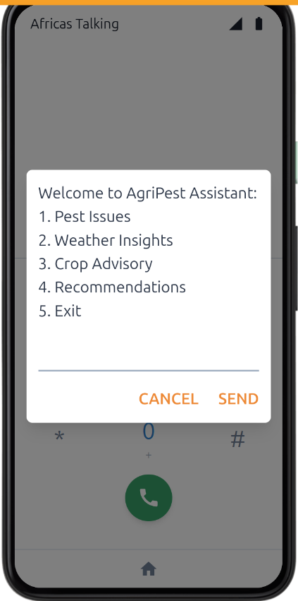
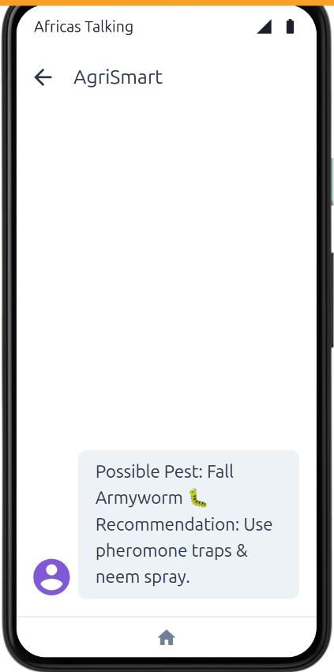

# AgriSmart USSD-to-SMS Assistant

AgriSmart is an offline agricultural assistant designed to empower farmers with actionable information via USSD and SMS. It enables users to access vital farming insights including pest management, weather forecasts, and crop recommendations — **without needing an internet connection**.

## Dial


## Menu


## Confirm Message


---

## Built With

- [Node.js](https://nodejs.org/)
- [Express.js](https://expressjs.com/)
- [Africa's Talking API](https://africastalking.com/)

---

## 🚀 Live Demo (via Simulator)

> 👉 Use the [Africa’s Talking SMS Simulator](https://account.africastalking.com/apps/sandbox/sms/simulator)

- Short code: `[your shortcode]` (Sandbox)
- Message: `Nimeona wadudu kwenye mahindi`
- Sender: Any fake number (e.g. `+2557xxxxxxx`)

---

## 🛠️ Tech Stack

- Node.js
- Express.js
- Africa’s Talking SMS API
- OpenAI GPT-4o / GPT-4o-mini
- Ngrok (for tunneling locally)

---

## 📦 Clone & Run Locally

### 1. Clone Repository

```bash
git clone https://github.com/your-username/agri_smart_ussd.git
cd agri_smart_ussd]
```

### 2. Install Dependencies

```bash
npm install
```

### 3. Setup Environment Variables

```.env
PORT=3000
AT_USERNAME=sandbox
AT_API_KEY=your_africastalking_api_key
```

### 4. Start Your Server

```bash
node index.js
```

### 5. Expose Your Localhost via ngrok

```bash
npx ngrok http 3000
```


### Example Flow:

1. User dials USSD code (e.g., `*384*500#`)
2. Navigates through options
3. Receives an SMS with relevant information based on their selection

---

## 📦 Project Structure

```bash
.
├── africastalking.js        # Africa's Talking SDK configuration
├── ussdRouter.js            # Handles USSD session logic
├── smsSender.js             # Sends SMS responses
├── app.js                   # Main Express server
├── .env                     # Environment variables (API keys, ports)
└── README.md
```